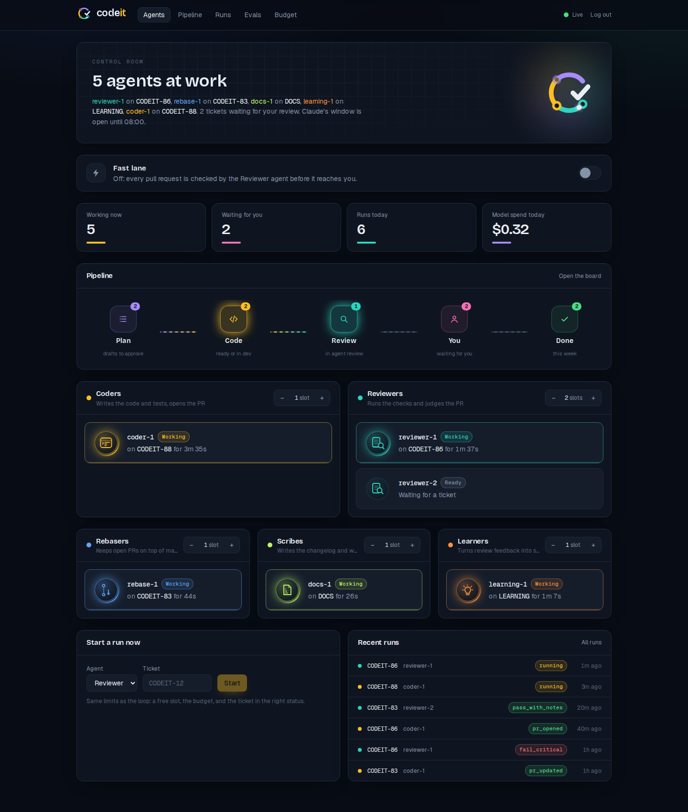

<p align="center"></p>

# CodeIt

A local multi-agent software delivery system for personal projects:
- A Planner turns a plan into Jira tickets.
- A Coder implements approved tickets in isolated Docker containers and opens PRs.
- A Reviewer runs checks and can send work back.
- A human reviews and merges.

Jira is the state machine. See [docs/prd.md](docs/prd.md) for the full spec and [docs/adr/](docs/adr/) for decisions.

<!-- codeit:status:start -->
_The Docs agent keeps this block current in the target repo's README (see [codeit-sandbox-app](https://github.com/Anik-AC/codeit-sandbox-app)). It cannot write to this repo: its token is scoped to the sandbox (ADR-0018)._
<!-- codeit:status:end -->

## Status

| Milestone | State |
|---|---|
| M0 Scaffold | Done |
| M1 Jira client | Done |
| M2 jira-mcp | Done |
| M3 Planner | Done |
| M4 Sandbox + Claude backend | Done |
| M4.5 Sandbox app ([codeit-sandbox-app](https://github.com/Anik-AC/codeit-sandbox-app)) | Done |
| M5 Coder | Done |
| M6 Reviewer | Done |
| M7 Orchestrator | Done |
| M8 API + dashboard | Done |
| M9 Eval harness | Done |
| M10 Rebase agent | Done |
| M11 Docs agent | Done |
| M12 Learning agent | In review |
| M13 Fallback backend | Planned (see PRD section 23) |

## Requirements

- Linux, macOS or Windows with WSL2. On Windows, keep the repo on the WSL filesystem (for example `~/projects/codeit`), not under `/mnt/c`.
- Python 3.12 and [uv](https://docs.astral.sh/uv/)
- Node LTS (for the dashboard and target apps). In WSL, install through `nvm` so the Linux `node` is used instead of the Windows one.
- Docker. On Windows, use Docker Desktop with **Settings > Resources > WSL Integration** enabled for your distro.
- `git`, `gh`, `jq`, and the Claude Code CLI

## Setup

```bash
uv sync
cp .env.example .env              # fill in credentials as milestones need them
uv run pre-commit install
uv run codeit config validate     # checks config/config.yaml
uv run codeit db upgrade          # creates data/codeit.db
```

## Usage

```bash
uv run codeit --help
uv run codeit config validate [-c path/to/config.yaml]
uv run codeit db upgrade
```

Commands for later milestones (`plan`, `run`, `sandbox`, `up`, `eval`, ...) are registered already. Until then they exit with a message naming their milestone.

## Jira setup

1. Set up the project as described in [PRD 7.1](docs/prd.md#71-one-time-manual-setup-owner): a team-managed project with key `CODEIT` (or whatever `project.jira_project_key` says), the statuses, the custom fields on the Story work type, and board estimation.
2. Fill in `.env`:

   ```bash
   JIRA_BASE_URL=https://<your-site>.atlassian.net
   JIRA_EMAIL=<the account's email>
   JIRA_API_TOKEN=<classic API token for that account>
   ```

   Create the token at https://id.atlassian.com/manage-profile/security/api-tokens. Until a bot account exists, your own account is fine (ADR-0001).
3. Check the setup, then record the site's IDs:

   ```bash
   uv run codeit jira doctor               # read-only checks, with a hint for each failure
   uv run codeit jira doctor --write-test  # also creates and deletes a test issue
   uv run codeit jira discover             # writes config/jira_ids.yaml (gitignored)
   ```

   Rerun `discover` after changing fields, statuses or work types in Jira.

## jira-mcp

The MCP server agents use to read tickets and comment. It runs on the host and holds the Jira token. What a caller sees depends on its role:

| Role | Tools |
|---|---|
| human (you, over stdio) | all six: `get_ticket`, `get_comments`, `search_tickets`, `add_comment`, `create_issue`, `link_issues` |
| planner | all but `add_comment` |
| learning | `get_ticket`, `get_comments`, `search_tickets` |
| coder, reviewer, rebase | `get_ticket`, `get_comments`, `add_comment` (own ticket only) |
| docs | `get_ticket`, `get_comments` |

No role can change a ticket's status. Keys and searches are limited to the configured project.

**Use it from interactive Claude Code** (stdio, role `human`). Run this once, from any directory:

```bash
claude mcp add codeit-jira --scope user -- ~/projects/codeit/.venv/bin/codeit-jira-mcp
```

Then ask Claude something like "get ticket CODEIT-2". Set `CODEIT_ROLE` in the server's environment to try another role, for example `claude mcp add ... -e CODEIT_ROLE=coder -- ...`.

**Smoke test with the MCP Inspector** (`-e` must come after the command):

```bash
npx @modelcontextprotocol/inspector --cli ~/projects/codeit/.venv/bin/codeit-jira-mcp --method tools/list
npx @modelcontextprotocol/inspector --cli ~/projects/codeit/.venv/bin/codeit-jira-mcp \
  --method tools/call --tool-name get_ticket --tool-arg key=CODEIT-2
npx @modelcontextprotocol/inspector --cli ~/projects/codeit/.venv/bin/codeit-jira-mcp \
  -e CODEIT_ROLE=coder --method tools/list        # shows only the coder's three tools
npx @modelcontextprotocol/inspector ~/projects/codeit/.venv/bin/codeit-jira-mcp   # browser UI
```

**HTTP with run tokens** (the path worker containers use from M4). Every request needs a bearer token bound to one role, one run and usually one ticket. Until the orchestrator mints them (M7), you can do it by hand:

```bash
uv run codeit mcp serve                     # http://127.0.0.1:8765/mcp (config: mcp:)
TOKEN=$(uv run codeit mcp token --role coder --ticket CODEIT-2)
cat > /tmp/mcp.json <<JSON
{"mcpServers": {"codeit-jira": {"type": "http", "url": "http://127.0.0.1:8765/mcp",
  "headers": {"Authorization": "Bearer $TOKEN"}}}}
JSON
claude -p "Use get_ticket for CODEIT-2 and give me its summary" \
  --mcp-config /tmp/mcp.json --strict-mcp-config --allowedTools mcp__codeit-jira__get_ticket
uv run codeit mcp revoke <run-id>           # the run ID is printed by `mcp token`
```

Tokens expire with the role's sandbox timeout plus `mcp.token_grace_minutes`. Only their SHA-256 is stored, in `data/codeit.db`.

## Planner

Turns a plan written in markdown into one Epic and a set of small Stories in Jira, all in `Agent Draft` with the label `agent-draft`. Stories that look too big (more than 5 points, or fewer than 2 acceptance criteria) also get `split-me`. Dependencies become "blocks" links. You then set priority and points and approve each Story (PRD 6).

```bash
uv run codeit plan docs/samples/sample-plan.md --dry-run   # draft and show; creates nothing
uv run codeit plan data/plans/<run>.json                   # create exactly that draft
uv run codeit plan my-plan.md                              # draft and create in one go
uv run codeit plan my-plan.md --epic CODEIT-40             # add Stories under an existing Epic
uv run codeit plan my-plan.md --epic "Q4 work"             # name the new Epic yourself
```

- **Backends:** the Planner uses Claude Code on your subscription (`claude -p` with every tool disabled). If Claude is unavailable, for example because of a usage limit, it falls back to OpenRouter's free models. That needs `OPENROUTER_KEY_OPS` in `.env`.
- **Repo context:** it reads the target repo's `CLAUDE.md` and file tree from `--repo` (default `data/repos/<target repo>`), and the open tickets in Jira.
- **Saved plans:** every plan is saved in `data/plans/` and recorded in the `runs` table with its prompt hash and estimated cost.
- **Invalid answers** are retried once with the validation errors.
- **Failures:** if Jira rejects any write, the run deletes what it created.

## Coder

Takes a ticket in `Ready for Dev` to a pull request (PRD 11.2):

```bash
uv run codeit run coder CODEIT-12            # claim, implement in a container, open or update the PR
uv run codeit run coder --file ticket.md     # local run: no Jira, the agent only commits in the clone
```

What a run does:

1. **Claims the ticket:** takes a lease, moves the ticket to `In Dev`, and sets `Agent` and `Run ID`.
2. **Prepares a workspace:** the ticket's clone on `{KEY}-{slug}`, or on the existing PR's branch for rework.
3. **Runs Claude Code in a worker container.** The container gets a coder run token for jira-mcp, and the prompt includes feedback since the last run (Jira comments and PR reviews).
4. **Applies the result.** If GitHub confirms the PR has new commits, the ticket gets `PR URL` and a remote link and moves to `Agent Review`. Otherwise it gets a comment and `needs-human`, and moves to `Human Review`. After a usage limit, it goes back to `Ready for Dev`.

It needs `CLAUDE_CODE_OAUTH_TOKEN`, `GITHUB_TOKEN_AGENT` and `GITHUB_TOKEN_READONLY` in `.env`, the worker image, and the target repo's steering kit.

**Steering kit.** The Coder follows the target repo's own instructions. Add them once:

```bash
uv run codeit init-target ~/projects/my-app   # CLAUDE.md, .claude/skills/*, .claude/settings.json + hooks
```

Then fill in the placeholder sections of `CLAUDE.md` and commit. The Stop hook runs the unit tests and refuses to let the agent finish while they fail. The edit hook lints each changed file.

## Reviewer

Reviews the PR of a ticket in `Agent Review` (PRD 11.3, ADR-0012):

```bash
uv run codeit run reviewer CODEIT-12
```

What a run does:

1. **Phase 1, checks:** runs the target's `codeit.yaml` commands in a worker container on the PR head: install, lint, typecheck, unit, e2e.
   - **`new_tests_fail_on_base`:** runs the PR's new or changed tests against the code from before the PR. At least one must fail. If they all pass, the tests don't test the change (`TESTS_DO_NOT_EXERCISE_CHANGE`).
   - **CI:** then it waits up to 10 minutes for GitHub CI.
2. **Phase 2, model review:** one call to a non-Anthropic model (default `deepseek/deepseek-v4.1-flash`) with the ticket, the diff and the check results. It returns a verdict (`pass`, `pass_with_notes` or `fail_critical`), acceptance-criteria coverage and findings.
3. **Override:** a failed install, typecheck, unit, e2e or `new_tests_fail_on_base` forces `fail_critical`, whatever the model said.
4. **Output:** posts a PR review (a comment, never an approval) and a shorter Jira comment.
5. **Routing:**
   - A pass goes to `Human Review`.
   - A `fail_critical` goes back to `Ready for Dev` with `Review Loop` + 1, so the Coder reworks it.
   - The 3rd failure goes to `Human Review` with `needs-human`.

It needs `GITHUB_TOKEN_AGENT` (to post the review), `GITHUB_TOKEN_READONLY`, `OPENROUTER_API_KEY` and the worker image. The review checklist the model follows is in `prompts/reviewer/checklist.md`.

## Orchestrator

`codeit up` runs the pipeline unattended (PRD 12, ADR-0013):

```bash
uv run codeit up              # jira-mcp, scheduler and merge watcher; Ctrl-C to stop
uv run codeit up --any-time   # ignore the Claude run window for this session
uv run codeit agents          # instances (busy, idle, parked, disabled) and leases
uv run codeit budget          # Claude window and parking, OpenRouter spend today
```

Every 45 seconds it:

1. **Recovers dead runs.** A run whose heartbeat stopped for 3 minutes (the process was killed) is abandoned: its container is removed and the ticket goes back to Ready for Dev, or to Human Review with `needs-human` the 2nd time.
2. **Starts Reviewers, then Coders,** while slots are free (`slots:` in `config.yaml`, re-read every loop) and the budget allows:
   - Claude runs only inside `claude.run_window` (default 23:00 to 08:00), one at a time, and not while parked after a usage limit
   - OpenRouter roles stay under their daily USD caps
   - tickets blocked by unfinished tickets are skipped
3. **Moves merged tickets to Done:** a ticket in Human Review whose PR is merged goes to Done. A Done ticket whose PR is not merged gets `state-mismatch`.

If you move a ticket yourself while an agent works on it, the agent's result is recorded but not applied. Ctrl-C lets running jobs finish for up to a minute; the rest resume on the next start.

**Network:** worker containers reach the internet only through the `codeit-proxy` container, and only the hosts in `sandbox.egress_allowlist` plus jira-mcp on the host. Build the proxy image with `codeit sandbox build`, which builds both images.

## Rebase agent

Keeps open agent PRs applying cleanly to main (PRD 11.5, ADR-0017). `codeit up` polls every `rebase.poll_minutes` (default 10). To run it once:

```bash
uv run codeit run rebase CODEIT-83              # --any-time lets Claude resolve conflicts outside its window
```

- **Clean rebase:** plain git, then CodeIt runs install, typecheck, unit and e2e, and pushes only if they are green.
- **Small conflicts:** Claude resolves them in a container, keeping both sides' changes. CodeIt then checks the result and runs the tests itself before pushing.
- **Escalated to you** (a Jira comment and `needs-human`, nothing pushed):
  - more than `rebase.max_files` conflicted files
  - lockfiles, migrations or `.github/` (`rebase.never_auto`)
  - failing tests
  - an agent that could not finish
- **Jira status never changes.** Conflicts outside Claude's run window wait for the window.

## Docs agent

Writes up what shipped, once a day (PRD 11.6, ADR-0018). `codeit up` runs it at `docs.run_at` (default 07:00). To run it now:

```bash
uv run codeit run docs
```

- **Input:** Done tickets without the `docs-logged` label, their PRs, the Reviewer's summaries and CodeIt's run costs.
- **Model:** one Claude call (`routing.docs`, the subscription) writes a changelog line per ticket and picks out design decisions and highlights. CodeIt writes the files itself.
- **Output:** one PR from `docs/{date}` in the target repo, with:
  - `CHANGELOG.md` (Keep a Changelog, grouped by Epic, lines ending `(KEY, #PR)`)
  - `docs/worklog/{date}.md` (tickets, review loops, human returns, decisions, cost per agent)
  - `docs/adr/NNNN-*.md` for each recorded decision
  - the README status block
- **Afterwards:** each ticket gets the `docs-logged` label, so the next run skips it.

## Learning agent

Turns review feedback into steering rules, and tests them with evals before you merge them (PRD 11.7, ADR-0019). `codeit up` runs it on Sunday at 22:00 (`learning.cron`), or sooner once 10 new human signals come in. To run it now:

```bash
uv run codeit run learning                                         # collect, learn, propose, gate
uv run codeit run learning --signals evals/suites/learning/signals.yaml   # a synthetic set
uv run codeit learning status                                      # signals, open lessons, proposals
uv run codeit learning gate                                        # finish pending eval gates only
```

1. **Collects signals:**
   - your Jira comments and PR reviews on agent work
   - the Reviewer's critical findings
   - failures in the latest eval runs

   CodeIt's own comments are left out.
2. **Finds lessons:** Claude turns each signal into a one-line lesson for the Coder, the Reviewer or the Planner. A lesson qualifies when it comes up twice, or once if you wrote `#learn` in the comment.
3. **Proposes rules:** one line per lesson, added under `## Learned from feedback` in the agent's steering file.
   - Coder rules: the target repo's `CLAUDE.md`, as a PR.
   - Reviewer and Planner rules: CodeIt's own prompts. Without a CodeIt token they arrive as a branch and a patch under `data/learning/`; add `GITHUB_TOKEN_CODEIT` to get PRs instead.
4. **Eval gate:** runs the matching eval before and after the change (Coder: 3 golden tasks; Reviewer: 18 seeded-bug variants; Planner: the Planner eval) and puts the table on the PR. A metric worse by more than 0.05 adds the `regression` label. The Coder part waits for Claude's run window.

It never merges anything.

## Dashboard

`codeit up` also serves a web dashboard and its API on http://127.0.0.1:8770 (PRD 14, ADR-0014). Build it once, and again after pulling dashboard changes:

```bash
uv run codeit dashboard build   # needs Node 24; exports dashboard/out
uv run codeit up                # then open http://localhost:8770
```

Log in with `CODEIT_API_TOKEN` from `.env`; the browser remembers it for 30 days. Everything updates live:


<sub>Screenshot with sample data. Also: [pipeline board](docs/images/dashboard-pipeline.png), [budget and run window](docs/images/dashboard-budget.png), [light theme](docs/images/dashboard-agents-light.png).</sub>


| Page | Shows |
|---|---|
| Agents | Each instance: busy, idle, parked (with the reason) or disabled; the ticket and for how long. Change slots with −/+. Start the Coder or Reviewer on a ticket now. |
| Pipeline | Tickets by Jira status, with points, review loops, PR links, and which agent holds them |
| Runs | Every run, filtered by agent or ticket, with status, time and cost |
| Run | The result (PR, review checks and verdict), orchestrator events, and the live Claude transcript |
| Budget | Claude window, parking and runs today; OpenRouter spend per role and free requests against their caps |

**Fast lane.** For times of fast delivery, switch on **Fast lane** on the Agents page, or run `uv run codeit fast-lane on`. PRs then skip the Reviewer agent and go straight to Human Review, labelled `fast-lane`. CI still has to pass, and you still merge (ADR-0016). Turn it off the same way.

Slot changes from the dashboard apply to the next claim and are kept in `data/slots.json`, which wins over `config.yaml`. Scripts can call the API with `Authorization: Bearer $CODEIT_API_TOKEN`.

For dashboard development: `cd dashboard && npm run dev` (port 3000, proxies `/api` to 8770).

## Evals

Measure the Coder and the Reviewer on fixed tasks (PRD 17, ADR-0015; details in [evals/README.md](evals/README.md)):

```bash
uv run codeit eval verify                  # check the suite itself
uv run codeit eval run --repeats 3         # the Coder on all 12 golden tasks, 3 times each
uv run codeit eval review                  # the Reviewer on 12 good and 24 seeded-bug patches
uv run codeit eval planner                 # the Planner on 3 sample plans, judged on INVEST
uv run codeit eval report --compare default,other
```

- **Golden suite:** 12 tasks on codeit-sandbox-app, all from one pinned commit: 4 of 1 point, 5 of 2, 3 of 3; API, UI and full-stack. Each has a ticket, hidden tests the Coder never sees, and a reference solution.
- **`eval run`:**
  - Runs the real Coder on a fresh clone, then scores it with the hidden tests.
  - Reports pass@1 (share of runs where every hidden test passes), pass^k (share of tasks that pass on every repeat), partial credit, and the median cost, turns, time and diff size.
  - `--review` also runs the Reviewer on each result.
- **Claude limits:** Coder evals use Claude like the orchestrator does. They wait for the run window (`--any-time` to override), take the one Claude slot, and stop cleanly if Claude hits its usage limit. A full run with 3 repeats is 36 Claude runs; start it in the evening.
- **`eval review`:** reports the Reviewer's catch rate on planted bugs and its false-fail rate on correct patches.
- **`eval planner`:** drafts three sample plans (`evals/suites/planner/`) without Jira and reports how many were valid, and an INVEST score and plan coverage from a judge model (rubric in `evals/rubrics/invest.md`).
- **Dashboard:** the Evals page charts pass@1 over time, per steering version (the Coder prompts and the target's steering kit).

## Models and keys

- **Who uses what** (`routing:` in `config/config.yaml`):
  - Coder, Rebase: Claude Code in containers, inside the Claude run window
  - Planner, Docs, Learning, Ops: Claude on the host (`claude -p`, your subscription), with the free OpenRouter list as a backup
  - Reviewer: paid OpenRouter models; it was tuned and evaluated on them
- **OpenRouter:** one key for everything: `OPENROUTER_API_KEY` in `.env`. The older per-role names still work.
- **Model lists:** the defaults are in `config/config.yaml` under `models:`. To change them, for price or to compare models, set these in `.env`:

  ```bash
  OPENROUTER_MODELS_PAID_REVIEW=vendor/model-a,vendor/model-b   # tried in order
  OPENROUTER_MODELS_FREE=...          # also _PAID_CHEAP
  OPENCODE_MODEL=openrouter/vendor/coder-model
  CLAUDE_MODEL=claude-opus-5-5        # unset: Claude Code's default
  ```

- `uv run codeit config validate` shows which model each list uses, and whether it comes from `.env`.

## Target repo

CodeIt's agents work on [`codeit-sandbox-app`](https://github.com/Anik-AC/codeit-sandbox-app), a small task tracker that can only list tasks so far (ADR-0010). Its `codeit.yaml` lists the commands agents and the Reviewer run: install, lint, typecheck, unit, e2e. `codeit.target.load_target_config` reads it.

To check that the target repo passes all its commands inside the worker image:

```bash
LIVE=1 uv run pytest tests/live/test_target_repo_live.py        # set CODEIT_TARGET_BRANCH for a branch
```

## Worker sandbox

Agents that change code run in Docker containers built from `sandbox/Dockerfile`. The image is Playwright 1.63 plus `gh`, `jq`, `uv`, Claude Code and OpenCode, running as user `agent` (UID 1000).
- **Mounts:** each container sees only its ticket's clone at `/workspace` and its run directory at `/run/codeit`.
- **Hardening:** every capability is dropped, and there are no new privileges.
- **Credentials:** only those of its role. Never a Jira token; containers reach Jira through jira-mcp at `host.docker.internal` with a run token.

```bash
uv run codeit sandbox build     # build codeit-worker:<version> (tag from sandbox.image)
uv run codeit sandbox smoke     # run claude -p in a container; checks the token and Docker
uv run codeit sandbox gc        # remove clones of Done/Rejected tickets and clones over 14 days old
```

`sandbox smoke` needs `CLAUDE_CODE_OAUTH_TOKEN` in `.env` (from `claude setup-token`). Transcripts go to `data/transcripts/<run>.jsonl` and container logs to `data/logs/containers/`. Per-ticket clones live in `data/worktrees/<repo>/<KEY>`, made from the mirror in `data/repos/<repo>`.

Until M7 adds the egress proxy, containers have unrestricted network access, so only run tickets you wrote.

## Development

```bash
uv run ruff check . && uv run ruff format --check .
uv run mypy
uv run pytest                     # unit tests; live tests are skipped
LIVE=1 uv run pytest -m live      # hits real Jira / GitHub / OpenRouter

Live Jira tests create issues labeled `codeit-live-test` and delete them afterwards. They need
the Jira setup above. The jira-mcp and Planner live tests also call `claude -p` on your
subscription (skipped if `claude` is not installed); the Planner test creates a full plan in
Jira and deletes it.
```

**Schema changes:** edit `src/codeit/db/models.py`, then run `uv run alembic revision --autogenerate -m "..."`. `tests/unit/test_db.py` fails if the models and migrations drift apart.

## Layout

| Path | Contents |
|---|---|
| `src/codeit/` | CLI, config, logging, db; orchestrator, agents, backends and clients land here per milestone |
| `src/codeit/evals/` | Eval harness: suite loading, workspaces, hidden-test scoring, runner, metrics, reports |
| `src/codeit/agents/` | Agents: `planner.py` and `planner_run.py` (`codeit plan`); `coder.py` and `coder_run.py` (`codeit run coder`); `reviewer/` (`codeit run reviewer`) |
| `src/codeit/backends/` | Model adapters: Claude Code (chat on the host, agentic in containers), OpenRouter, routing, parking |
| `src/codeit/sandbox/` | Worker containers, per-ticket clones, run glue, garbage collection |
| `prompts/`, `templates/` | Versioned prompts per role; Jira description templates |
| `src/codeit/github_client/` | GitHub REST: PRs, feedback, check runs, PR reviews |
| `src/codeit/orchestrator/` | `codeit up`: scheduler, leases, reaper, budget guard, merge watcher, API (`api.py`) and event bus |
| `src/codeit/target.py` | The target repo's `codeit.yaml` |
| `src/codeit/run_tokens.py` | Per-run jira-mcp tokens (mint, verify, revoke) |
| `src/codeit/jira_client/` | Async Jira client: retries, ADF, search, issues, transitions, comments, doctor, discover |
| `config/` | `config.yaml`, plus `jira_ids.yaml` written by `codeit jira discover` |
| `mcp_servers/jira/` | jira-mcp server: role-filtered tools, run-token auth |
| `sandbox/` | Worker image (`Dockerfile`) and egress proxy image (`proxy/`) |
| `evals/` | Golden suite (tasks, hidden tests, reference patches, seeded bugs) and eval configs |
| `dashboard/` | Next.js dashboard, exported to `dashboard/out` and served by the API |
| `docs/` | PRD, ADRs, work log |
| `data/` | Runtime state (gitignored) |
